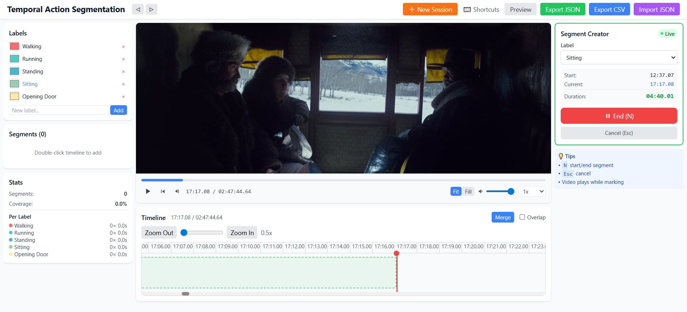

# Temporal Action Segmentation Labeling Tool

A powerful, browser-based annotation tool for labeling actions in long videos for temporal action segmentation research. This tool is designed to create high-quality labeled datasets that can be used to train deep learning models like **ASFormer**, **MS-TCN**, **Temporal U-Net**, and other action segmentation architectures.

   

## 📋 Overview

Temporal action segmentation is a crucial task in video understanding where the goal is to segment long, untrimmed videos into temporal intervals and assign action labels to each interval. Deep learning models like **ASFormer** (ICCV 2021) and **MS-TCN** (CVPR 2019) have achieved state-of-the-art performance on this task, but they require high-quality labeled datasets for training.

This tool provides a complete workflow for creating such datasets:

1. **Load videos** from your local machine
2. **Watch and annotate** action segments in real-time
3. **Manage multiple action classes** with customizable colors
4. **Fine-tune segment boundaries** with frame-level precision
5. **Export annotations** in JSON/CSV formats ready for model training



## 🎯 Use Cases

- **Academic Research**: Create labeled datasets for temporal action segmentation papers
- **Model Training**: Generate training data for models like ASFormer, MS-TCN, SSTDA, etc.
- **Video Understanding**: Annotate activities in cooking videos, sports footage, assembly tasks, etc.
- **Human Activity Recognition**: Label complex multi-step activities in egocentric videos
- **Dataset Creation**: Build custom datasets for specific domains (surgical procedures, manufacturing, etc.)

## ✨ Features

### 🎬 Video Playback & Control

- **Local video files**: Load videos directly from your computer (MP4, WebM, AVI)
- **Full playback controls**: Play/Pause, volume, speed control (0.25x - 2x)
- **Frame-by-frame navigation**: Step through video frame by frame for precise annotation
- **Responsive video player**: Automatically scales to fit your screen
- **Video fit modes**: Fit to screen, fill, or cover options

### ⏱️ Timeline Annotation

- **Interactive timeline**: Visual representation of the entire video duration
- **Drag & resize segments**: Click and drag to adjust segment boundaries
- **Zoomable timeline**: Zoom in/out for frame-level precision or zoom out for overview
- **Real-time segment preview**: See segments being created live as the video plays
- **Visual color coding**: Each action class gets a distinct color
- **Non-overlapping mode**: Prevent overlapping segments for proper segmentation
- **Snap to boundaries**: Segments snap to neighboring boundaries for clean annotation

### 🏷️ Label Management

- **Custom action classes**: Define your own set of actions (e.g., "Walking", "Opening Door")
- **Color picker**: Assign custom colors to each action class
- **Edit/delete labels**: Modify or remove action classes as needed
- **Default presets**: Comes with common action labels to get started quickly
- **Persistent storage**: Labels are saved and restored between sessions

### ⚡ Real-Time Segment Creation

- **Live annotation**: Watch the video and mark segments in real-time
- **Quick start/end**: Press `N` to start a segment, press `N` again to end it
- **Segment Creator Panel**: Live duration counter shows segment length as you annotate
- **Change labels on-the-fly**: Switch action labels while the segment is being recorded
- **Visual feedback**: Pulsing indicator shows active segment recording

### ⌨️ Keyboard Shortcuts

- **Space**: Play/Pause video
- **←/→**: Seek backward/forward 5 seconds
- **Shift + ←/→**: Previous/Next frame
- **N**: Start/End segment while watching
- **S**: Split segment at current time
- **Delete/Backspace**: Delete selected segment
- **Esc**: Cancel current segment
- **Ctrl/Cmd + Z**: Undo
- **Ctrl/Cmd + Shift + Z**: Redo
- **Ctrl/Cmd + N**: New session
- **?**: Toggle keyboard shortcuts overlay

### 💾 Data Management

- **Export JSON**: Complete annotation data with video metadata, segments, and label classes
- **Export CSV**: Tabular format with label, start_sec, end_sec, start_frame, end_frame
- **Import JSON**: Restore previous annotation sessions
- **Auto-save**: Automatically saves to IndexedDB every 30 seconds
- **Multiple sessions**: Work on different videos with separate annotation sets
- **New Session**: Clear all data and start fresh with a new video

### 🎨 User Interface

- **Dark/Light mode**: Automatic theme support
- **Collapsible panels**: Hide/show side panels for more video space
- **Segment list**: View all segments sorted by time, click to seek
- **Statistics panel**: See annotation coverage and per-label statistics
- **Merge segments**: Combine adjacent segments with the same label
- **Context menus**: Right-click segments for quick actions
- **Tooltips**: Helpful hints throughout the interface
- **Responsive design**: Works on desktop and tablet devices

### 🔄 Advanced Features

- **Undo/Redo**: Full history tracking for all changes
- **Split segments**: Divide segments at the current playhead position
- **Segment preview**: See segment details with exact timestamps
- **Frame-accurate**: All times tracked with millisecond precision
- **Offline-first**: Works completely offline, no internet required
- **Privacy-focused**: All data stays on your machine

## 📦 Installation

### Prerequisites

- Node.js (v16 or higher)
- npm (v7 or higher) or yarn

### Quick Start

```bash
# Clone the repository
git clone https://github.com/yourusername/temporal-action-segmentation-tool.git
cd temporal-action-segmentation-tool

# Install dependencies
npm install

# Start the development server
npm start
```

The application will open automatically at `http://localhost:3000`

### Build for Production

```bash
npm run build
```

This creates a `build` folder with optimized, minified files that can be served by any static file server.

## 🚀 Usage Guide

### 1. Start a New Session

1. Open the tool in your browser
2. Click on the video area to upload a video file
3. The video player will appear with the timeline below it

### 2. Define Action Classes

1. In the left panel, find the "Labels" section
2. Add action labels relevant to your video (e.g., "Cooking", "Walking")
3. Customize colors for each action class using the color picker

### 3. Annotate Segments

#### Method 1: Live Annotation (Recommended)

1. Click "Start Segment" in the right panel or press `N`
2. The video continues playing
3. Watch the duration counter in the right panel
4. Press `N` again or click "End Segment" when the action ends
5. The segment is created with the current label

#### Method 2: Manual Input

1. Double-click on an empty area of the timeline
2. Enter the start and end times manually
3. Select the action label
4. Click "Add Segment"

### 4. Fine-Tune Segments

- **Move**: Click and drag a segment horizontally
- **Resize**: Drag from the left or right edge
- **Delete**: Right-click and select "Delete" or press Delete key
- **Split**: Press `S` to split a segment at the current time
- **Merge**: Click "Merge" to combine adjacent segments with the same label

### 5. Export Annotations

1. Click "Export JSON" to save complete annotation data
2. Click "Export CSV" for a spreadsheet-compatible format
3. Use "Preview" to see the output before saving

## 📊 Output Format

### JSON Structure

```json
{
  "video_file": "cooking_video.mp4",
  "duration_sec": 120.5,
  "fps": 30,
  "segments": [
    {
      "label": "Cutting Vegetables",
      "start_time": 0.0,
      "end_time": 15.3,
      "start_frame": 0,
      "end_frame": 459
    },
    {
      "label": "Stirring",
      "start_time": 15.3,
      "end_time": 45.8,
      "start_frame": 459,
      "end_frame": 1374
    }
  ],
  "label_classes": [
    { "name": "Cutting Vegetables", "color": "#FF6B6B" },
    { "name": "Stirring", "color": "#4ECDC4" }
  ]
}
```

### CSV Structure

```csv
label,start_sec,end_sec,start_frame,end_frame
Cutting Vegetables,0.0,15.3,0,459
Stirring,15.3,45.8,459,1374
```


## 🏗️ Tech Stack

- **React 18** - UI framework
- **TypeScript** - Type safety
- **Tailwind CSS** - Styling
- **IndexedDB** - Local storage
- **HTML5 Video API** - Video processing

## 🌐 Browser Support

- Chrome (recommended)
- Firefox
- Safari
- Edge

<!-- ## 📝 License

This project is licensed under the MIT License - see the [LICENSE](LICENSE) file for details. -->

## 🤝 Contributing

Contributions are welcome! Here's how you can help:

1. Fork the repository
2. Create a feature branch (`git checkout -b feature/amazing-feature`)
3. Commit your changes (`git commit -m 'Add amazing feature'`)
4. Push to the branch (`git push origin feature/amazing-feature`)
5. Open a Pull Request

### Areas for Contribution

- Additional export formats (YOLO, COCO, etc.)
- Video annotation import from other tools
- Multi-track annotation support
- Automated segment boundary detection
- PWA support for offline installation
- Mobile optimization

## 📚 Related Research

This tool is designed to create datasets for the following research areas:

- **Temporal Action Segmentation**: Segmenting long videos into action segments
  - ASFormer: Transformer for Action Segmentation (Yi et al., 2021)
  - MS-TCN: Multi-Stage Temporal Convolutional Network (Farha & Gall, 2019)
  - SSTDA: Self-Supervised Temporal Domain Adaptation (Chen et al., 2020)

- **Action Recognition**: Classifying actions in video clips
- **Video Understanding**: Higher-level understanding of video content
- **Human-Robot Interaction**: Learning from demonstration


